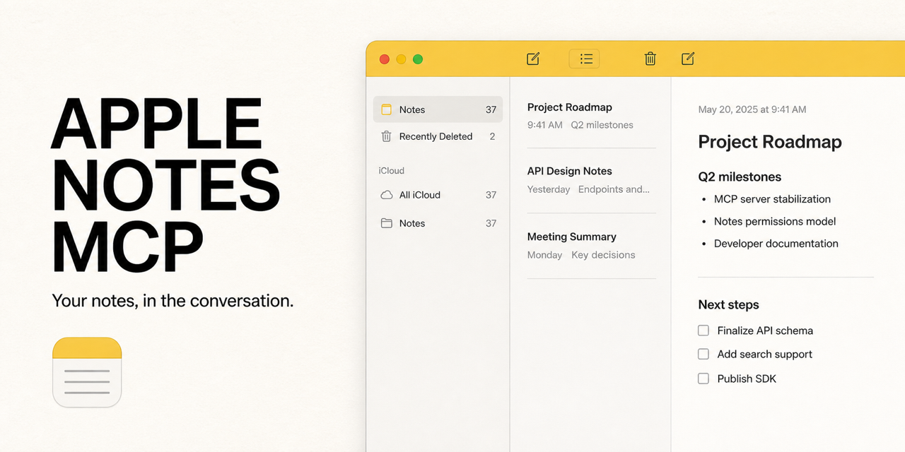
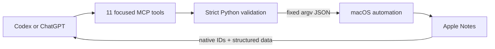

<p align="center">
  
</p>

<h1 align="center">Apple Notes MCP</h1>

<p align="center"><strong>Your notes, in the conversation.</strong></p>

<p align="center">
  <a href="https://github.com/henryvn27/apple-notes-mcp/actions/workflows/ci.yml"></a>
  <a href="LICENSE"></a>
  
  
</p>

A small, local-first MCP plugin that lets Codex or ChatGPT work with the Notes
app already on your Mac.

```text
You: Find my notes about the launch.
AI: Found 3 notes. The most recent is “Launch checklist”.

You: Add these decisions to the project brief.
AI: Appended the decisions to “Project brief”.

You: Start a note called Competition ideas in Projects.
AI: Created “Competition ideas” in “Projects”.
```

Find it. Read it. Add to it. Keep thinking. Notes stay in the native app; there
is no cloud database, replacement editor, or dependency install.

## Install in Codex

```bash
codex plugin marketplace add henryvn27/apple-notes-mcp
codex plugin add apple-notes@apple-notes-mcp
```

Start a new Codex task after installation. The first Notes request may make
macOS ask whether Codex or Python can control Notes. Choose **Allow**.

### Let an agent install it

Paste this into a Codex task:

```text
Install the Apple Notes plugin from
https://github.com/henryvn27/apple-notes-mcp on this Mac.

First inspect the configured plugin marketplaces and installed plugins. If an
Apple Notes plugin is already enabled from another marketplace, stop and
explain the conflict. Do not install a duplicate or remove existing config.

Otherwise, run:
codex plugin marketplace add henryvn27/apple-notes-mcp
codex plugin add apple-notes@apple-notes-mcp

Verify that apple-notes@apple-notes-mcp is installed and enabled. Then tell me
to start a new Codex task so the plugin loads. Remind me to choose Allow if
macOS asks whether Codex or Python can control Notes. Do not create, change,
move, or delete a real note while verifying the installation.
```

Then ask naturally:

```text
List my Notes folders.
Find notes containing “launch” that I changed this month.
Open the most recent project brief.
Create a note called Competition ideas in Projects.
Append these decisions to the project brief.
Rename the note to Final project brief.
Move the brief to Archive.
Replace the text in this attachment-free draft.
Delete the temporary draft.
```

## What it can do

| Tool | What it does | Safety |
| --- | --- | --- |
| `list_note_folders` | Lists native accounts, folders, hierarchy, IDs, sharing, and note counts | Read-only |
| `create_note_folder` | Creates one top-level folder in an explicit or default account | One folder; no folder delete |
| `rename_note_folder` | Renames one folder | Exact folder ID; shared folders stay read-only |
| `search_notes` | Searches title and plaintext; filters by account, folder, subfolders, and modification range; paginates | Read-only; returns previews |
| `get_note` | Reads one exact note, including HTML, plaintext, and attachment metadata | Exact note ID; never returns attachment files |
| `add_note` | Creates one escaped-plaintext note | Explicit or default folder |
| `append_to_note` | Appends escaped plaintext without replacing rich content | Exact note ID |
| `rename_note` | Changes one note title | Exact note ID |
| `move_note` | Moves one note | Exact note and destination folder IDs |
| `replace_note_content` | Replaces title/body with escaped plaintext | Exact ID; destructive; blocked when attachments exist |
| `delete_note` | Moves one note to Apple Notes’ Recently Deleted folder | Exact ID; destructive but recoverable in Notes |

Shared and password-protected notes are read-only. Shared folders cannot be
created in, renamed, or targeted by moves. Replacing content is blocked when a
note has attachments because replacing Notes' HTML body could remove them.

Search returns concise plaintext previews. `get_note` is the explicit full-read
tool. Native IDs returned by discovery tools are the reliable targets for later
actions; ambiguous folder or account names are rejected.

There is no bulk delete, folder delete, attachment writer, account mutation, or
password operation. Those limits are deliberate: a short AI request should not
silently erase a notebook, attachment, shared document, or locked note.

## How it works



The server uses Python's standard library and one fixed JavaScript for
Automation bridge. User content is serialized as JSON in a process argument;
it is never interpolated into shell commands or executable source. Plaintext
writes are escaped before they become Notes HTML.

## ChatGPT

ChatGPT does not connect directly to a local stdio MCP process. On supported
plans and workspaces, a custom MCP app can reach this server through OpenAI's
Secure MCP Tunnel without opening an inbound public port. See the current
[developer mode and MCP app requirements](https://help.openai.com/en/articles/12584461-developer-mode-apps-and-full-mcp-connectors-in-chatgpt-beta).

When a remote client or tunnel is involved, Notes data returned by a tool is
also visible to that client and tunnel. Local Codex use needs no API key and
adds no project-owned network service.

## Develop

```bash
cd plugins/apple-notes
/usr/bin/python3 -m unittest discover -s tests -v
python3 -m py_compile server.py
osacompile -l JavaScript -o /tmp/apple-notes.scpt notes.js
```

Automated tests do not open Notes or alter notes. Live mutations happen only
through MCP `tools/call` requests.

## Security

Please report vulnerabilities through
[GitHub private vulnerability reporting](https://github.com/henryvn27/apple-notes-mcp/security/advisories/new).
The trust boundary and mutation rules are documented in
[SECURITY.md](SECURITY.md).

## License

MIT © Henry Van Ness

Apple, Notes, and macOS are trademarks of Apple Inc. This project is
independent and is not affiliated with or endorsed by Apple.
